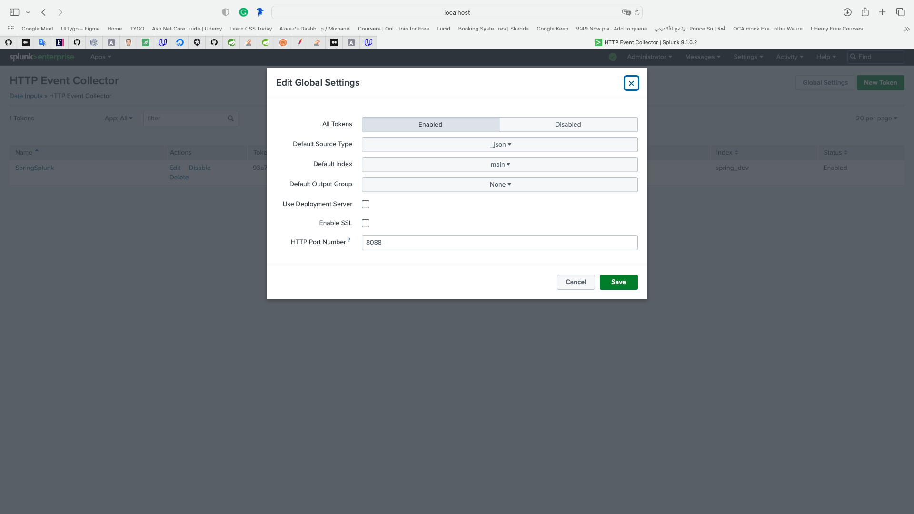
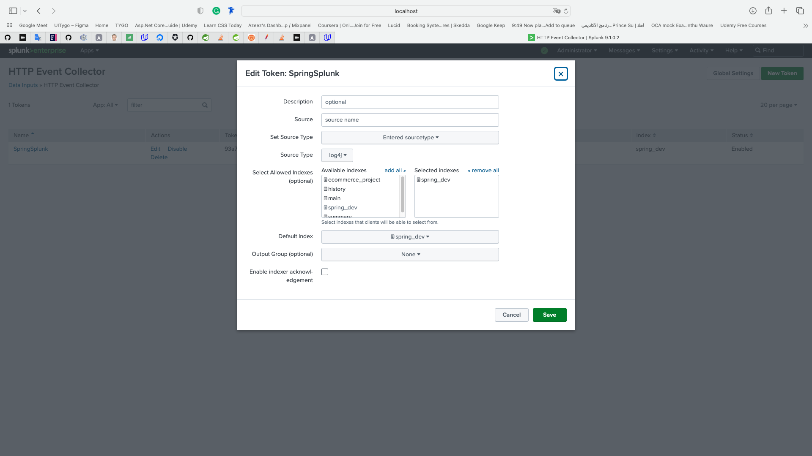
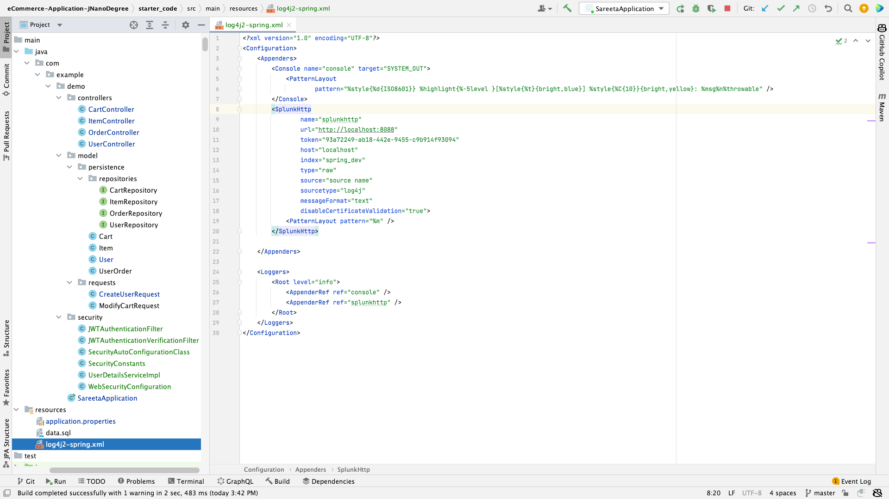

# Required Pictures

## Splunk

### 1- Splunk Global Configuration

### 2- Creating HTTP Event Collector to index all _log statements_ in the application to Spunk

### 3- HTTP Event Collector is created successfully

### 4- Splunk Configuration in the Code _log4j2-spring.xml_

### 5- making the search with the created index _spring_dev_

### 6- Creating an alert of _successful creation of users_

### 7- Alert is created successfully

### 8- Searching with the alert

## Jenkins

### 1- Jenkins maven Job

### 2- Connecting the Job with the Project on GitHub

### 3- Locating pom.xml file of the Project to Jenkins

### 4- Executing the Job

